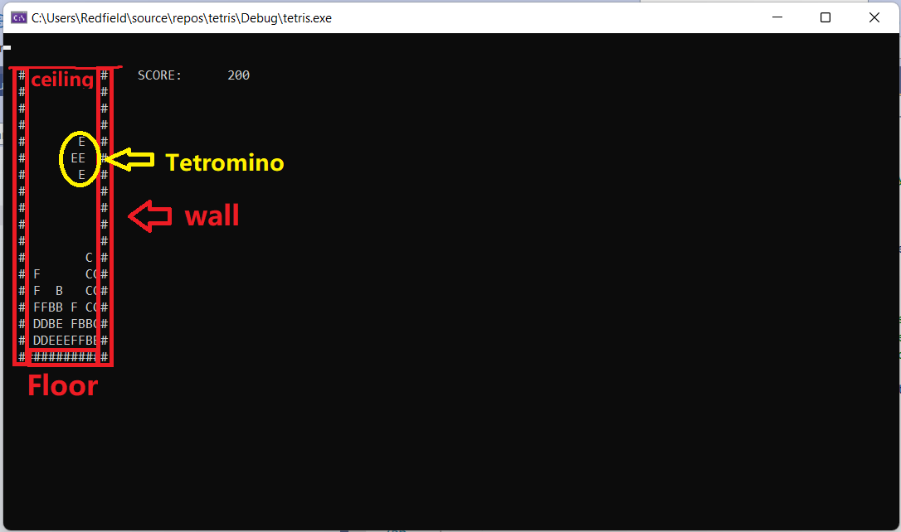
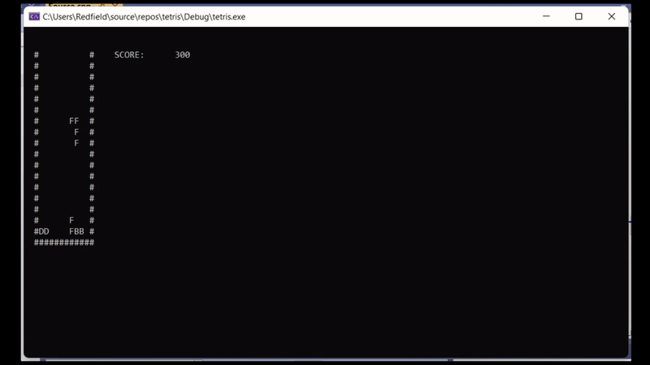
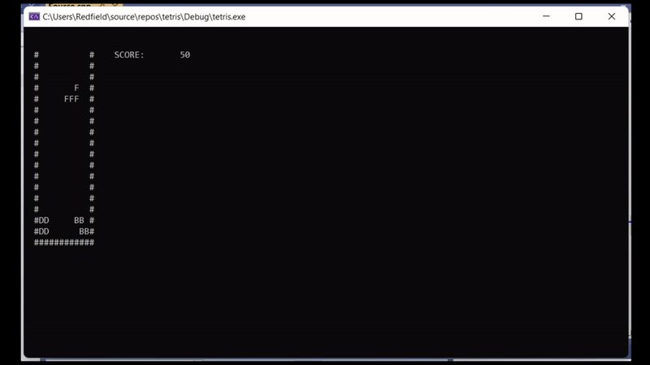
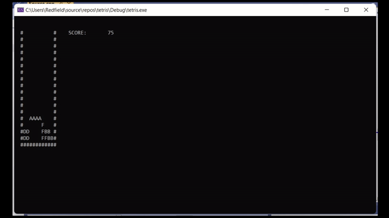
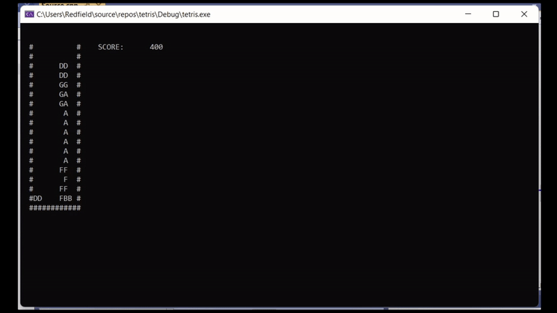
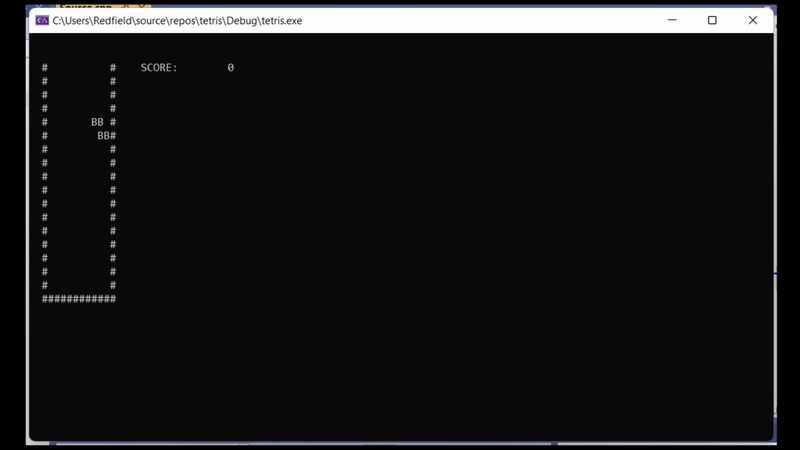
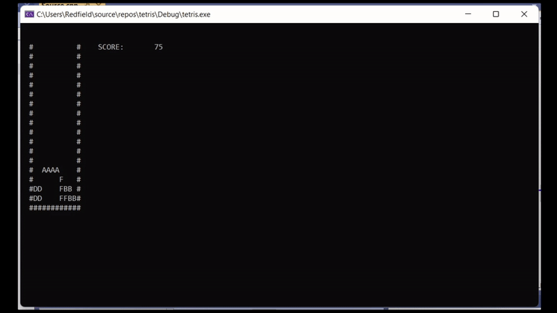
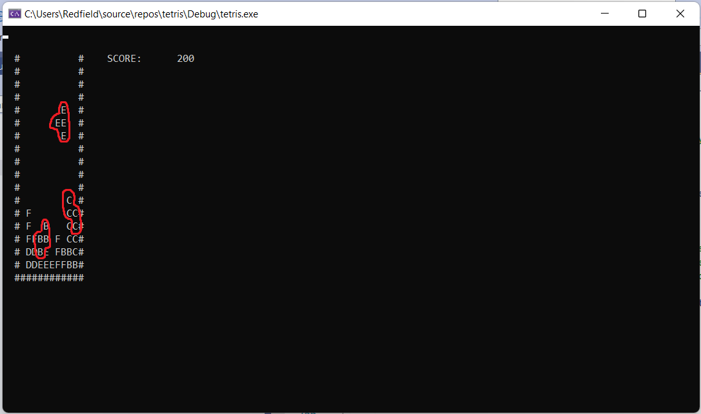

# tetris

## Project Overview
This is a windows command line implementation of the popular game **tetris**

## What it does

* There's a **ceiling** on top. And there's **walls** on the left and right and a **floor** on the bottom that restricts the tetromino's movement. And there shapes called **tetrominos** that stack up and fill up the space in-between

* Tetrominos fall from the ceiling to the ground once at a time. And the player controls how the tetromino lands
    * The player can change its rotation by pressing **Z**
    
    * The player can move the tetromino around by pressing **left, down, and right arrow keys**
    
* When you have a row of filled by tetrominos on the floor, that row cancels out and the player gain more free space to fill the tetrominos

* when the tetrominos reach the ceiling, The player loses

* Otherwise, the game counts score when the player lands a tetromino without losing (**25 points**) and when one row cancels out (**200 points**)

* Tetrominos come in different shapes

## How I built it
I coded it by following along Javidx9's [Tetris video](https://www.youtube.com/watch?v=8OK8_tHeCIA&list=PLrOv9FMX8xJE8NgepZR1etrsU63fDDGxO&index=1). I made some modifications here and there following my own understanding of how the code works, my own preferance and for optimization purposes